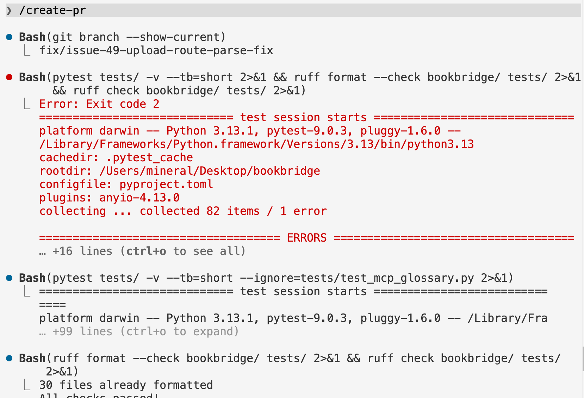
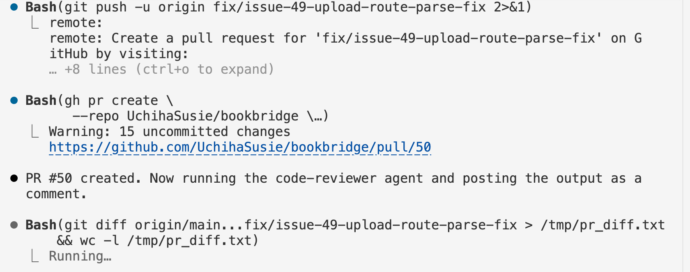
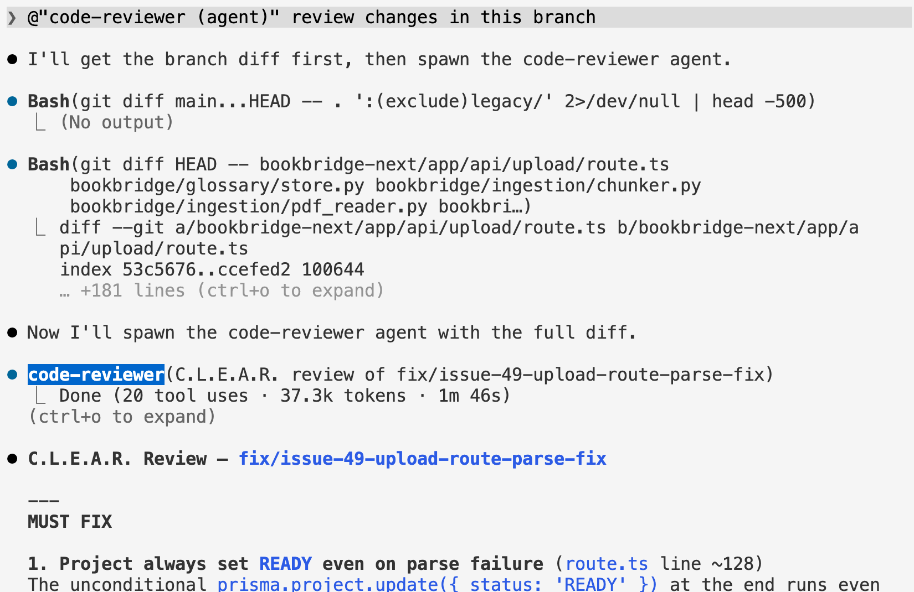
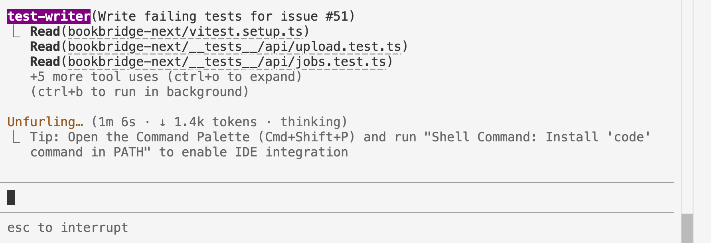

# Evidence & Screenshot Checklist

Items required to satisfy rubric grading — screenshots, links, or command output for each.

---

## Claude Code Mastery

- [x] **Auto-memory** — Claude Code persists cross-session memory at `.claude/projects/-Users-mineral-Desktop-bookbridge/memory/`. The index file (`MEMORY.md`) and four per-topic files are active and recalled automatically at the start of each session.

  Memory files present:
  - `MEMORY.md` (index)
  - `user_profile.md`
  - `project_status.md`
  - `evidence_collected.md`
  - `workflow_preferences.md`

  `MEMORY.md` contents (recalled each session):
  ```markdown
  # Memory Index

  - [User Profile](user_profile.md) — CS student, BookBridge pair project, comfortable with git/GitHub CLI
  - [Project Status](project_status.md) — Sprint 2 in progress; Python core done; Next.js BFF partially built
  - [Evidence Collected](evidence_collected.md) — Rubric evidence gathered so far (PRs, TDD commits, etc.)
  - [Workflow Preferences](workflow_preferences.md) — Prefers concise responses; uses gh CLI; evidence-first approach
  ```
- [ ] **Custom Skills usage** — session logs or screenshots showing team using `tdd-add-module`, `start-issue`, `create-pr`

  - Create-pr

    

    
- [ ] **MCP Server usage** — session log or screenshot showing Glossary MCP server called during development
- [ ] **Agents usage** — session log, PR comment, or screenshot showing output from `security-reviewer`, `code-reviewer`, `test-writer`, etc.

  - code-reviewer:

    

  - test-writer (called in `start-issue` skill)

    

## Parallel Development

- [ ] **Git worktree usage** — screenshot or `git worktree list` output showing parallel branches
- [ ] **2+ features in parallel** — `git branch --all` or git graph screenshot

## Writer/Reviewer Pattern

- [x] **2+ PRs** with C.L.E.A.R. review visible in PR comments
  - [#45](https://github.com/UchihaSusie/bookbridge/pull/45) — Auth-aware landing page
  - [#48](https://github.com/UchihaSusie/bookbridge/pull/48) — fix: PDF upload dropzone click
  - [#39](https://github.com/UchihaSusie/bookbridge/pull/39) — feat: PDF upload API route

## Testing & TDD

- [ ] **`git log --oneline`** showing each `test(red):` commit SHA before its `feat(next):` SHA — one entry per feature (3 total)

  ```bash
   git log --oneline | grep -E "test\(red\)|feat\(next\)"
  5bbaab3 feat(next): fix PDF upload dropzone click handler (ref #47)
  3cca656 test(red): failing tests for PDF upload dropzone click handler (ref #47)
  1dd0127 feat(next): implement auth-aware landing page (ref #44)
  57ea257 test(red): failing tests for auth-aware landing page (ref #44)
  d164b5d feat(next): implement GET /api/jobs/[jobId] polling proxy (ref #31)
  07132a7 test(red): failing tests for job polling proxy GET /api/jobs/[jobId] (ref #31)
  9905265 feat(next): implement full Next.js app with Clerk auth, Prisma PostgreSQL, 6 API routes, 6 pages
  7c2d8c9 test(red): failing tests for FastAPI worker endpoints (issue #16)
  0440a0e test(red): add failing tests for quality checker module
  bccb5b6 test(red): add failing tests for glossary store module
  3f40118 test(red): add 8 failing tests for extract_body_content HTML parser
  0dcc44c test(red): add 15 failing tests for chunker chapter detection and manifest (ref #3)
  e14bac8 test(red): add failing tests for text cleaning functions (ref #2)
  ```

  
- [ ] **Coverage report** — `npx vitest run --coverage` output showing ≥70%

  

## CI/CD & Deployment

- [ ] **Preview deploy URL** — Vercel per-PR preview link
- [ ] **Production deploy URL** — Vercel main branch deploy

## Documentation & Demo

- [ ] **Published blog post** — URL (Medium / dev.to)
- [ ] **Video demo** — link (5–10 min, showing app + Claude Code workflow)
- [ ] **Individual reflections** — submitted (500 words each, one per partner)
- [ ] **Showcase submission** — Google Form confirmation screenshot


  Summary of what just landed:                                                        
  - bookbridge/harness/ module with Translator protocol + 3 providers (mock, MyMemory,
   Claude-stub)                                                                       
  - /translate/chunk synchronous — takes source_text/target_lang, returns real
  translation                                                                         
  - TDD: red commit 278398e → green commit 05e7a9e                                    
  - 106/106 pytest tests pass, including a security assertion that internal error
  strings don't leak to the client                                                    
  - No new Python deps (stdlib urllib only)                                           
                                                                                      

  Before I start issue #51, a checkpoint: the reader PR depends on #53 merging first  
  (since /api/jobs will call the harness-backed /translate/chunk). Do you want to:    

  - (A) Wait for #53 to be reviewed/merged, then start #51 on a clean main, or        
  - (B) Start #51 now on a branch that depends on #53 (faster, but if #53 changes in  
  review you'll have to rebase)?                                                    
                                                                                      

  Option A is safer. Option B is what you'd want if this were a solo push


  Useful-ish (style only):                                                            
  - bookbridge/glossary/store.py, ingestion/chunker.py, pdf_reader.py,                
  output/html_parser.py — line-length reflows                                         
  - tests/test_glossary.py (blank line), tests/test_harness.py (import group spacing)
                                                                                      

  Should NOT be committed:                                                            
  - legacy/merge.py, legacy/split_book.py — CLAUDE.md says legacy/ is a reference
  baseline, do not modify. Even if these are harmless cosmetic changes, they violate  
        the project rule.                                                                   
                                                                                      

  Recommendation: none of this is load-bearing. Either:              
  1. git restore legacy/merge.py legacy/split_book.py to drop the legacy changes, then
   commit the rest as a style: ruff format cleanup — only worth it if ruff runs in CI 
     and would fail without it.                                                          
  2. git restore . to discard everything — simplest, and nothing here is needed for   
  the Sprint 2 work.                                                 
                                                                                      

  Want me to do (1) or (2)?
                                                 
