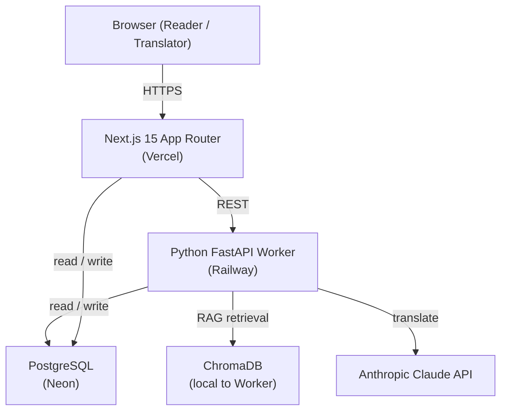

> **Team:** See [`docs/workflow-checklist.md`](docs/workflow-checklist.md) for rubric progress — please review and tick off items you've completed.

# BookBridge

BookBridge is an AI-powered long-document translation web platform. Upload a PDF, select chapters to translate, and read the results in an immersive two-column bilingual view. Terminology stays consistent across the entire book via a project-scoped glossary.

**Live:** _coming Sprint 2_ · **Stack:** Next.js 15 · Python FastAPI · PostgreSQL · Claude API · Vercel + Railway

---

## Architecture



| Layer | Technology |
|---|---|
| Frontend / BFF | Next.js 15 App Router |
| Authentication | Clerk |
| Database | PostgreSQL (Neon) via Prisma |
| Translation Worker | Python 3.11 + FastAPI (Railway) |
| Vector Retrieval | ChromaDB (RAG glossary injection) |
| LLM | Anthropic Claude API |
| CI/CD | GitHub Actions |
| Deployment | Vercel (Next.js) + Railway (Worker) |

---

## Sprint Progress

| Sprint | Goal | Status |
|---|---|---|
| 1 — Python Foundation | Core Python modules: ingestion, glossary, quality checker, MCP server | ✅ Complete |
| 2 — Deploy First | FastAPI Worker + Next.js shell + full CI/CD pipeline live | 🔄 In progress |
| 3 — Next.js Full Features | PDF upload → parse → translate → glossary management | ⬜ Planned |
| 4 — Reading View + Polish | Two-column reader, publish/share, E2E tests | ⬜ Planned |

---

## Project Structure

```
bookbridge/
├── CLAUDE.md                        # AI assistant context: conventions, architecture, OWASP
├── .mcp.json                        # MCP server config shared with the team
├── .pre-commit-config.yaml          # Gate 1: Gitleaks secrets scan on every commit
├── .claude/
│   ├── settings.json                # Claude Code hooks (lint-on-edit, test gate)
│   ├── skills/
│   │   ├── tdd-add-module.md        # TDD workflow for adding Python modules (v2, iterated from v1)
│   │   ├── tdd-add-module-v1.md     # v1 baseline (kept for git-history evidence)
│   │   ├── start-issue.md           # Creates a branch and prints acceptance criteria for an issue
│   │   └── create-pr.md             # Runs checks, writes PR with C.L.E.A.R. + AI disclosure
│   └── agents/
│       ├── rubric-workflow-architect.md  # Rubric analysis and sprint planning agent
│       ├── security-reviewer.md          # OWASP-aware PR security review (Gate 3 sub-agent)
│       └── code-reviewer.md              # C.L.E.A.R. correctness review — invoke before opening a PR
├── .github/
│   ├── pull_request_template.md     # AI disclosure table + C.L.E.A.R. checklist on every PR
│   ├── ISSUE_TEMPLATE/
│   │   └── feature.md               # Gate 7: security DoD checklist on every issue
│   └── workflows/
│       └── security.yml             # Gates 1–3: Gitleaks + npm audit + Claude AI security review (posted as PR comment)
├── bookbridge/                      # Python Worker package
│   ├── ingestion/                   # PDF extraction, text cleaning, chapter chunking
│   ├── glossary/                    # SQLite + ChromaDB glossary store
│   ├── harness/                     # Translation orchestrator (chunk → Claude API → PostgreSQL)
│   ├── quality/                     # Per-language quality checkers
│   └── mcp_servers/                 # Glossary MCP server (5 tools + 1 resource)
├── tests/                           # 81 tests, all passing
├── docs/
│   ├── PRD.md                       # Product requirements (English)
│   ├── PRD-zh.md                    # Product requirements (Chinese)
│   ├── API_DESIGN.md                # Internal API specifications
│   └── workflow-checklist.md        # Rubric workflow requirements and completion tracker
└── legacy/                          # Original manual pipeline (read-only reference)
```

---

## Security Gates

5 of 8 rubric gates active — exceeds the W14 Security minimum of 4.

| Gate | Tool | Status |
|---|---|---|
| 1 — Secrets detection | Gitleaks pre-commit (`.pre-commit-config.yaml`) | ✅ Active |
| 2 — Dependency scanning | `npm audit --audit-level=high` in CI | ✅ Active (runs when `package.json` exists) |
| 3 — SAST / sub-agent | `security-reviewer` Claude sub-agent + AI review posted as PR comment in CI | ✅ Active |
| 7 — Definition of Done | Security checklist in `.github/ISSUE_TEMPLATE/feature.md` | ✅ Active |
| — OWASP awareness | OWASP Top 10 mapped to BookBridge defenses in `CLAUDE.md` | ✅ Active |

OWASP Top 10 mapping documented in [`CLAUDE.md`](CLAUDE.md#security-owasp-top-10--bookbridge-mapping).

**One-time setup:**
```bash
pip install pre-commit
pre-commit install
```

Add `ANTHROPIC_API_KEY` to GitHub repo secrets for the AI review step in CI.

---

## Development Workflow

Every issue follows the same cycle:

```
/start-issue <n>   →   write code (TDD)   →   /code-reviewer   →   fix issues   →   /create-pr <n>   →   teammate reviews   →   merge
```

**`/start-issue <n>`** — fetches the issue from GitHub, creates a correctly-named branch (`feat/issue-<n>-...`), and prints the acceptance criteria.

**`/code-reviewer`** — runs the C.L.E.A.R. correctness review (Correctness, Logic, Efficiency, Architecture, Risks) on the current changes before opening a PR. Fix any MUST FIX items, then proceed to `/create-pr`.

**`/create-pr <n>`** — runs lint + tests, writes a PR description with C.L.E.A.R. self-review checklist and AI disclosure metadata, then opens the PR. CI then automatically posts a Claude security review as a PR comment.

### Writer/Reviewer Pattern

| Role | Agent | When |
|---|---|---|
| Writer | Claude Code (main session) | During development |
| Correctness Reviewer | `code-reviewer` sub-agent (`/code-reviewer`) | Before opening PR — manual |
| Security Reviewer | `security-reviewer` sub-agent + CI (`security.yml`) | Automatically on every PR as a comment |

### TDD cycle (Python Worker)

```bash
pytest tests/test_<module>.py -v          # RED — all fail
# implement
pytest tests/test_<module>.py -v          # GREEN — all pass
ruff format bookbridge/ tests/
ruff check bookbridge/ tests/
```

Commit conventions: `test(red):` → `feat(green):` → `refactor:`

---

## Running Tests

```bash
pip install -e ".[dev]"
pytest tests/ -v --tb=short
pytest tests/ --cov=bookbridge --cov-report=term
```

---

## MCP Server

```bash
claude mcp add glossary-server -- python -m bookbridge.mcp_servers.glossary_server --db /path/to/glossary.db
```

See [docs/MCP_SETUP.md](docs/MCP_SETUP.md) for full setup instructions.
