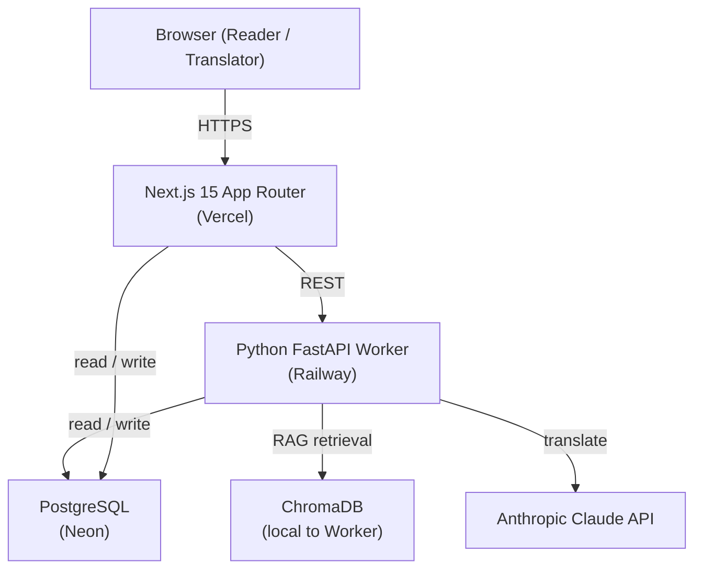

# BookBridge

**AI-powered long-document translation web platform.** Upload a PDF, select chapters to translate, and read the results in an immersive two-column bilingual view. Terminology stays consistent across the entire book via a project-scoped glossary.

**Live:** <https://bookbridge-next.vercel.app/>
**Worker:** <https://passionate-serenity-production-3cdd.up.railway.app/>

---

## For graders — start here

**👉 [`docs/report.md`](docs/report.md)** — the full submission report. Covers all six rubric categories (Application Quality · Claude Code Mastery · Testing & TDD · CI/CD & Production · Team Process · Documentation & Demo) with inline links to every evidence artefact.

Evidence bundles referenced from the report:

| Bundle | Contents |
|---|---|
| [`docs/evidence/mcp-playwright/`](docs/evidence/mcp-playwright/) | Playwright MCP session — 2 screenshots, 2 accessibility snapshots, 2 console logs, README |
| [`docs/evidence/coverage/`](docs/evidence/coverage/) | Raw terminal output of `vitest --coverage` (86.9% stmts) and `pytest --cov=bookbridge` (77%) |
| [`docs/claude-memory/`](docs/claude-memory/) | Sanitized snapshot of the Claude Code auto-memory directory (8 files) |
| [`docs/sprint-1-planning.md`](docs/sprint-1-planning.md) · [`docs/sprint-1-retrospective.md`](docs/sprint-1-retrospective.md) | Sprint 1 — Python Foundation |
| [`docs/sprint-2-planning.md`](docs/sprint-2-planning.md) · [`docs/sprint-2-retrospective.md`](docs/sprint-2-retrospective.md) | Sprint 2 — Deploy First |
| [`docs/standups.md`](docs/standups.md) | Async-coordination record with honest gap disclosure (see report §5.4) |

---

## Architecture



| Layer | Technology |
|---|---|
| Frontend / BFF | Next.js 15 App Router |
| Authentication | Clerk |
| Database | PostgreSQL (Neon) via Prisma |
| Translation Worker | Python 3.11 + FastAPI (Railway) |
| Vector Retrieval | ChromaDB (RAG glossary injection) |
| LLM | Anthropic Claude API |
| CI/CD | GitHub Actions |
| Deployment | Vercel (Next.js) + Railway (Worker) |

---

## Project structure

```
bookbridge/
├── CLAUDE.md                 # AI assistant context: conventions, architecture rules, OWASP Top 10 map
├── .mcp.json                 # MCP server config (glossary-server + playwright)
├── .pre-commit-config.yaml   # Gitleaks secrets scan (Security Gate 1)
├── .claude/
│   ├── commands/             # Custom skills: /tdd-add-module, /start-issue, /create-pr
│   ├── skills/               # v1 baselines kept for git-history evidence
│   ├── settings.json         # Hooks: PreToolUse TDD gate, PostToolUse ruff, Stop pytest
│   └── agents/               # Sub-agents: code-reviewer, security-reviewer, test-writer, product-architect, rubric-workflow-architect
├── .github/
│   ├── workflows/            # ci.yml (lint/typecheck/tests/E2E/AI-review) · security.yml (Gitleaks/Bandit/Semgrep/npm audit)
│   ├── ISSUE_TEMPLATE/       # feature.md with Security Definition of Done checklist
│   └── pull_request_template.md    # C.L.E.A.R. self-review + AI disclosure metadata
├── bookbridge/               # Python Worker package (ingestion, glossary, harness, quality, worker_api, mcp_servers)
├── bookbridge-next/          # Next.js 15 App Router (app/, lib/, prisma/, __tests__/, e2e/, vitest.config.ts, playwright.config.ts)
├── tests/                    # Python tests — 110 passing, 77% coverage
└── docs/                     # PRD, API_DESIGN, submission report, evidence/, claude-memory/, sprint + standup docs
```

---

## Running tests

**Python Worker:**

```bash
pip install -e ".[dev]"
pytest tests/ -v --tb=short
pytest tests/ --cov=bookbridge --cov-report=term --ignore=tests/test_mcp_glossary.py
```

**Next.js:**

```bash
cd bookbridge-next
npm run test:run            # Vitest unit + integration
npm run test:coverage       # with coverage (86.9% statements)
npx playwright test         # Playwright E2E (requires dev server on :3000)
```

Raw coverage output is archived at [`docs/evidence/coverage/`](docs/evidence/coverage/).

---

## MCP servers

Both MCP servers are declared in [`.mcp.json`](.mcp.json) and picked up automatically on repo clone:

- **`glossary-server`** — custom Python MCP exposing glossary term lookup / insertion / search to any Claude Code session (originally built during Sprint 1 for the Python CLI pipeline)
- **`playwright`** — `@playwright/mcp@latest` used to drive a headful browser for live UI verification (see the archived session at [`docs/evidence/mcp-playwright/`](docs/evidence/mcp-playwright/))

See [`docs/MCP_SETUP.md`](docs/MCP_SETUP.md) for setup details.
