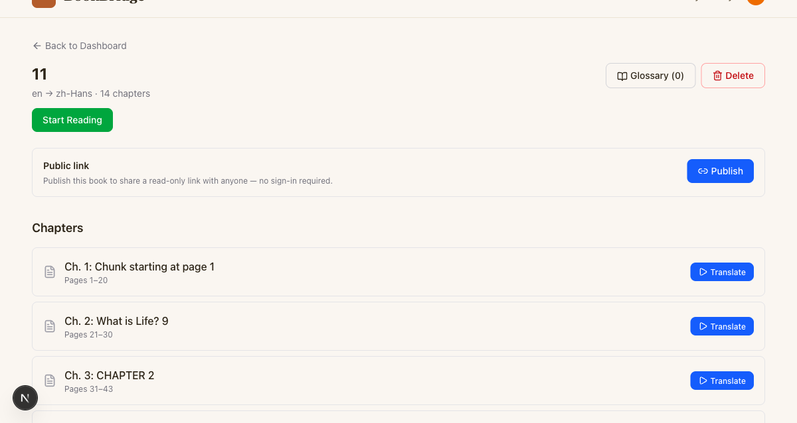
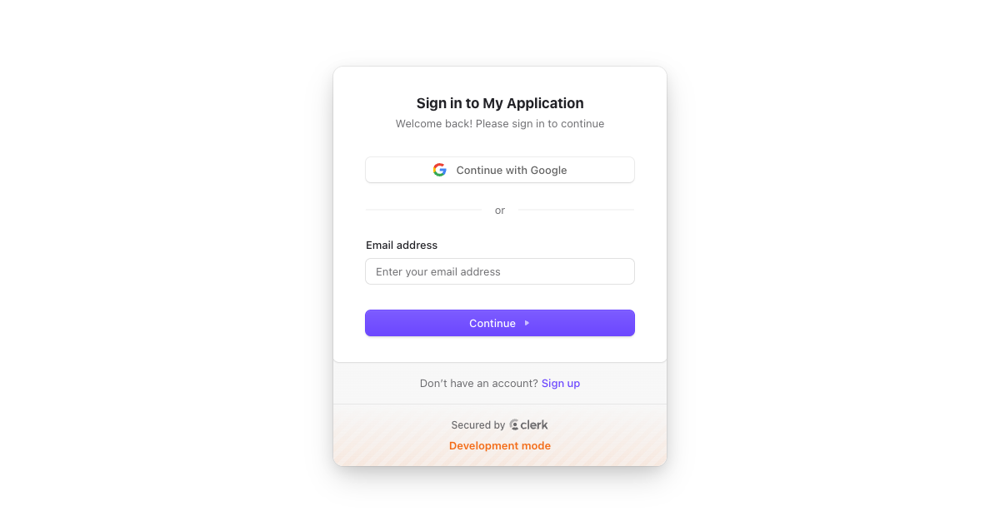

# Playwright MCP session — UI layout adjustment

**Date:** 2026-04-21 02:40–02:44 UTC · Duration ≈ 1m 4s
**Task given to Claude Code:** *"use playwright mcp to move the green start reading button right under the book title and subtitle"*

## Final verified result

## Development flow demonstrated

1. **Prompt (human)** — one-line UI change request (above).
2. **Context read (AI)** — `bookbridge-next/CLAUDE.md`, `bookbridge-next/AGENTS.md`.
3. **Code change (AI)** — edited `bookbridge-next/app/dashboard/projects/[id]/page.tsx:41-67`, lifting the `<Link>Start Reading</Link>` out of the right-side flex group and placing it in the title block with `mt-3 inline-block`.
4. **Browser verification (AI via Playwright MCP)** — opened `http://localhost:3000/dashboard`, which Clerk redirected to sign-in:

   

   The human signed in once in the Playwright-controlled window, then the AI navigated to project `cmo7ztwiw0007dmmlq82hdjnh` (the 14-chapter book titled "11", en → zh-Hans), captured the accessibility snapshot (`page-2026-04-21T02-44-07-837Z.yml`), took the final screenshot (`after-move.png` above), and confirmed: green "Start Reading" now sits on its own row directly under the "11" title and the "en → zh-Hans · 14 chapters" subtitle; Glossary (0) and Delete remain anchored top-right.

## Why this is rubric-relevant

Playwright MCP is wired into the AI-assisted development loop — not just as a test harness, but as the feedback channel that lets Claude **see** the UI it just changed. The loop "AI reads code → AI writes code → AI opens the live browser → AI + human verify" closes the gap that otherwise forces the human to re-run the app, take screenshots, and describe the result back to the AI in text.

## Files in this folder

| File | What it is |
|---|---|
| `signin-prompt.png` | Screenshot of the Clerk sign-in redirect on first page load (auth flow is real, not mocked) |
| `after-move.png` | Final verified layout — green "Start Reading" directly under title/subtitle |
| `page-2026-04-21T02-40-51-053Z.yml` | Playwright accessibility snapshot on initial load (pre-auth) |
| `page-2026-04-21T02-44-07-837Z.yml` | Playwright accessibility snapshot of the project detail page after the layout change (post-auth) |
| `console-2026-04-21T02-40-50-065Z.log` | Browser console for the initial load |
| `console-2026-04-21T02-44-07-078Z.log` | Browser console during verification |
